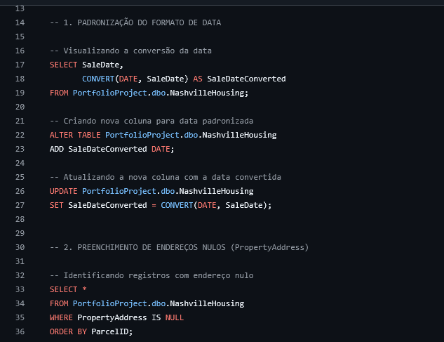

# Habitações em Nashville – Limpeza de Dados com SQL Server

Este projeto tem como objetivo realizar a **limpeza, padronização e preparação de dados** do dataset *Nashville Housing* utilizando **SQL Server (T-SQL)**.

O foco é transformar dados brutos em uma base estruturada, confiável e pronta para análises exploratórias e geração de insights.

---

---

## Sobre o Dataset:

A base contém informações sobre vendas de imóveis na cidade de **Nashville (EUA)**, incluindo:

- Endereço do imóvel
- Endereço do proprietário
- Data da venda
- Valor da venda
- Informações legais da transação
- Indicador *Sold As Vacant*

Este tipo de base simula cenários reais do mercado imobiliário, onde dados frequentemente chegam com inconsistências, campos duplicados e valores ausentes

---

##  Processo de Limpeza e Transformação:

### 1 Padronização de Datas
- Conversão da coluna `SaleDate` para o tipo `DATE`
- Criação da coluna `SaleDateConverted` para armazenar o valor tratado

---

### 2 Tratamento de Valores Nulos
- Identificação de registros com `PropertyAddress` nulo
- Preenchimento utilizando `JOIN` com base no `ParcelID`

---

### 3 Separação de Endereços em Colunas Estruturadas

**Endereço do Imóvel:**
- `PropertySplitAddress`
- `PropertySplitCity`

**Endereço do Proprietário:**
- `OwnerSplitAddress`
- `OwnerSplitCity`
- `OwnerSplitState`

Aplicação de funções de string para extração e organização das informações.

---

### 4 Padronização de Valores Categóricos
Conversão dos valores da coluna `SoldAsVacant`:

- `'Y'` → `'Yes'`
- `'N'` → `'No'`

Uso da estrutura `CASE` para garantir consistência nos dados.

---

### 5 Remoção de Registros Duplicados
- Identificação de duplicatas utilizando `ROW_NUMBER()` com `PARTITION BY`
- Utilização de CTE para controle
- Exclusão segura mantendo apenas o primeiro registro válido

---

### 6 Remoção de Colunas Desnecessárias
Após as transformações, foram removidas colunas que não seriam mais utilizadas:

- `OwnerAddress`
- `TaxDistrict`
- `PropertyAddress`
- `SaleDate`

Isso garante uma base mais limpa e otimizada para análises futuras.

---

## Conceitos de SQL Aplicados:

- `UPDATE` com `JOIN`
- `CTE (Common Table Expression)`
- `ROW_NUMBER()`
- `CASE`
- `ISNULL`
- Funções de manipulação de string:
  - `SUBSTRING`
  - `CHARINDEX`
  - `PARSENAME`
  - `REPLACE`

---

##  Objetivo do Projeto:

Este projeto demonstra habilidades fundamentais para atuação em:

- Análise de Dados
- Business Intelligence
- Engenharia de Dados (nível inicial)

Reforça a importância da etapa de **Data Cleaning**, garantindo que análises futuras sejam feitas sobre dados consistentes e confiáveis.

---

Gabriel França da Silva  
Estudante de Análise de Dados  

